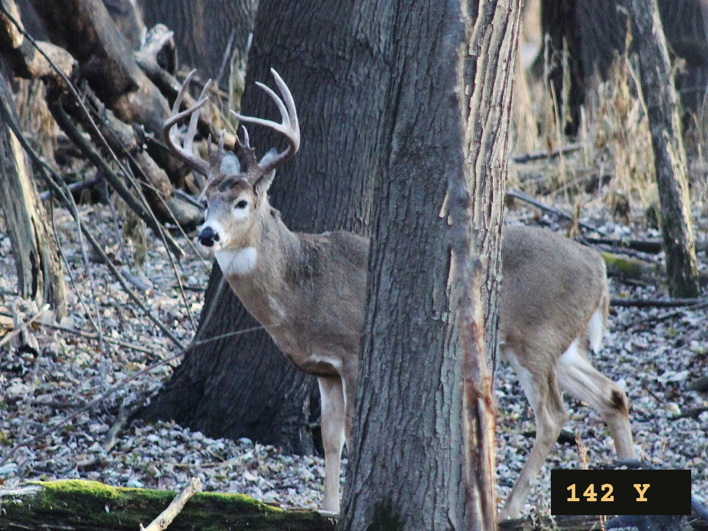
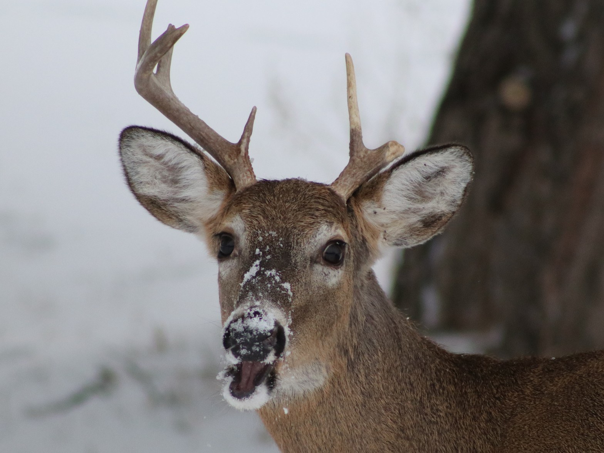
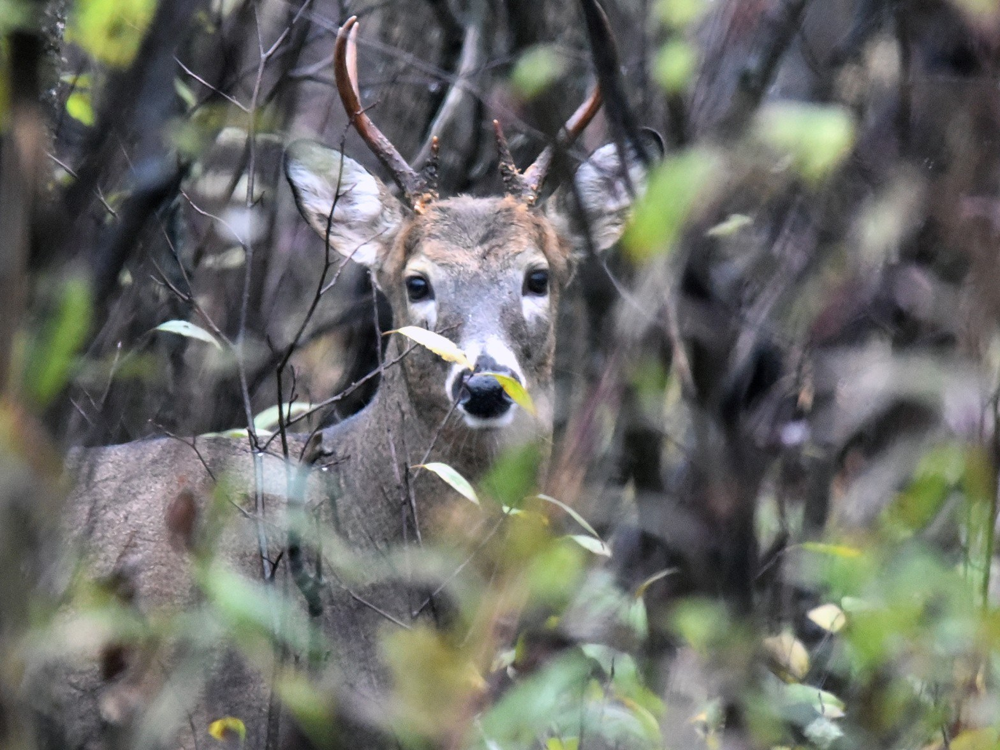

# Test photos for Sidewinder

Three whitetail bucks for trying the app. On the iPhone you are testing with,
**press and hold each photo, then tap "Save to Photos"**. In Sidewinder, tap
**LIBRARY** on the Score tab and pick one.

The distance is optional, but entering it makes the estimate more accurate.
Photo 1 shows a rangefinder readout, so Sidewinder fills in 142 yards on its
own.

## 1 — 142 yards (readout in the photo)

## 2 — 64 yards

## 3 — 97 yards

---

Photos: U.S. Fish and Wildlife Service, public domain. Photo 1 by Courtney
Celley/USFWS; the rangefinder readout was added for testing.
